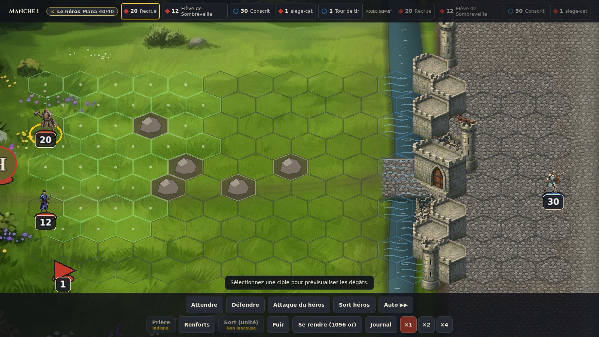
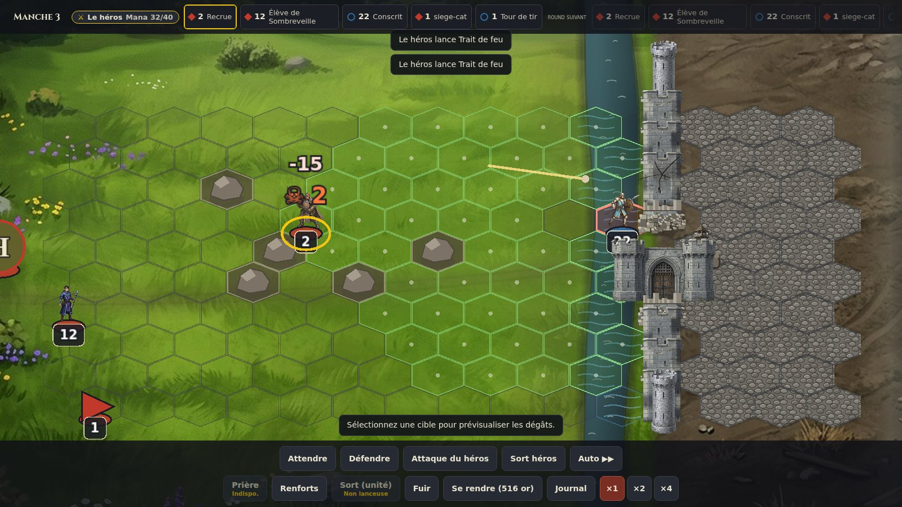
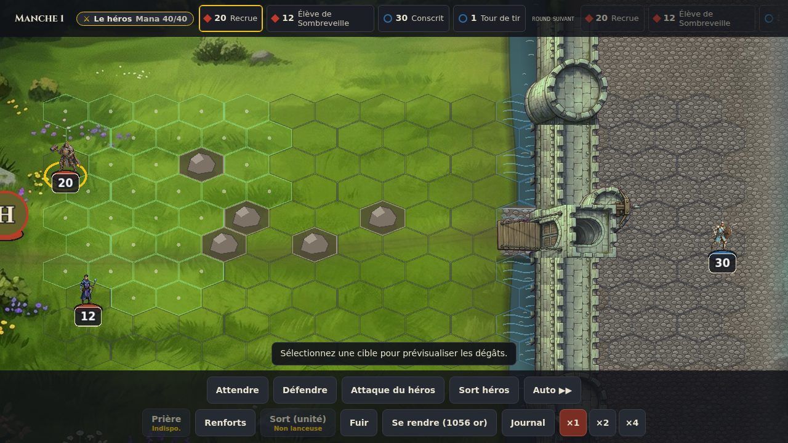
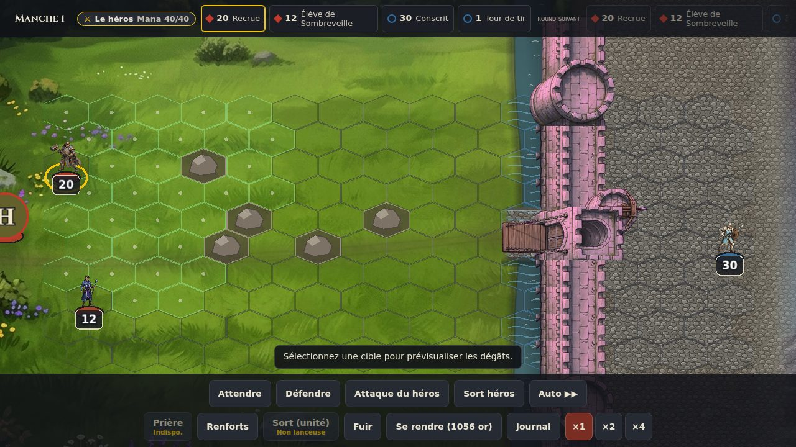
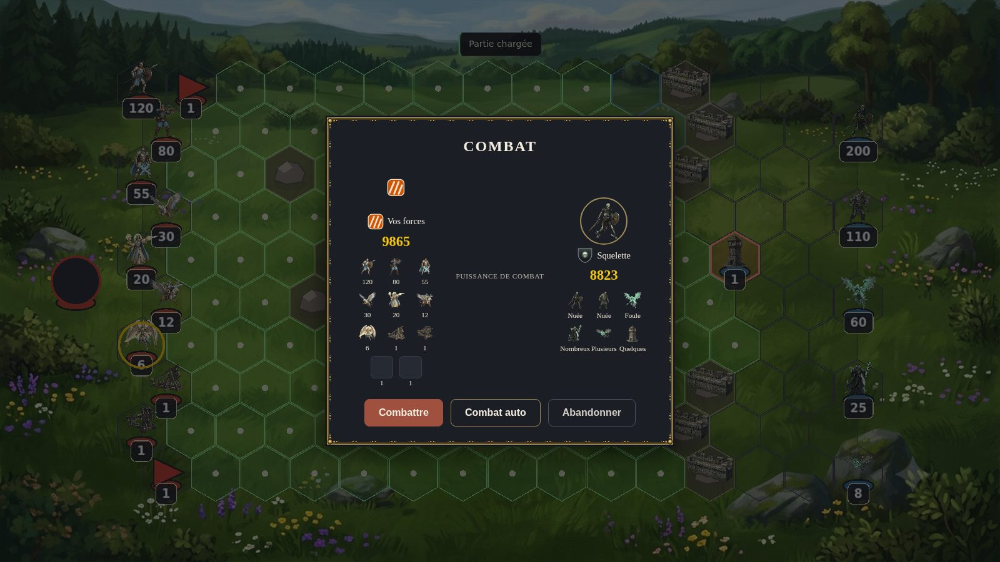
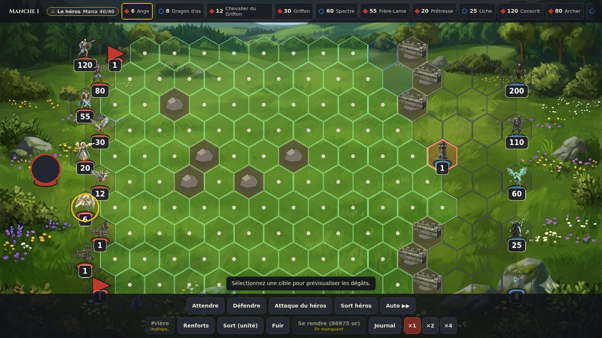
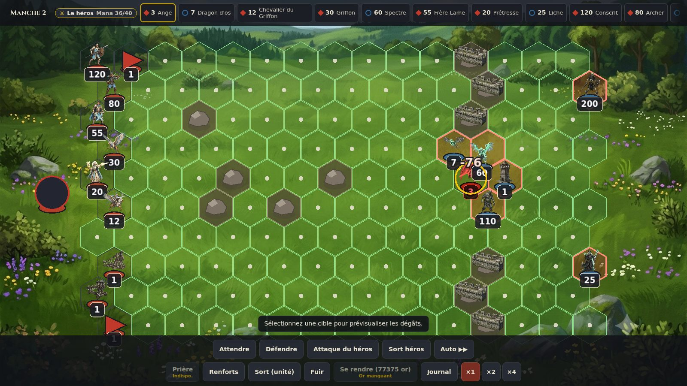
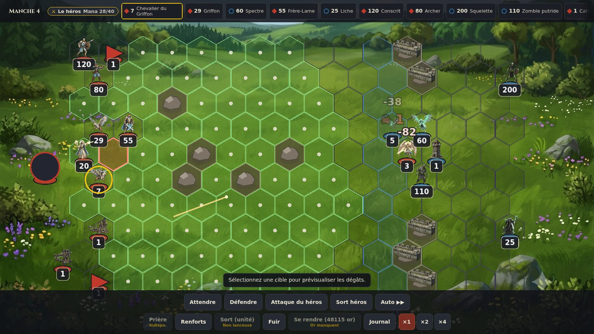

# 19 — Analyse graphique & cohérence : combat de siège de ville

> **Nature** : audit visuel (aucun changement de code). Captures in-game réelles
> du build de prod, prises en Chromium headless (1600×900, locale fr-FR) sur un
> état forgé reproductible ; méthode en annexe. Complète l'audit doc 18 (écarts
> vs Heroes Online) sur la seule scène de **siège** : armée assaillante avec
> machines de guerre contre ville défendue par rempart, douve, tour de tir et
> garnison.

## 0. Refonte (2026-07) — la scène possède l'image

Après ~10 retouches pièce par pièce restées insuffisantes (historique en
`docs/captures/siege/after-*.jpg`), le rendu a été **repensé en composition**
(plan `.claude/plans/siege-visual-overhaul.md`). Diagnostic des racines : la
grille de gameplay possédait l'image et le décor y était boulonné (sprites
frontaux sur plateau iso, procédural vectoriel sur toile peinte, grille
criarde, aucune ville visible, échelles incohérentes). La refonte inverse le
rapport, façon HoMM3 : un **champ de bataille peint d'un seul tenant** dans
lequel la grille se glisse discrètement.

- **Scène peinte plein-cadre** (`combat/siege-scene[-<factionId>].jpg`,
  générateur déterministe `tools/assets/gen_siege_scene.py`, doc 12 Règle S) :
  sol complet — prairie peinte (toile `combat-grass` réutilisée ⇒ cohérence
  avec les combats de plaine), boue d'approche + chemin vers la porte, fossé
  creusé, cour intérieure en terre battue, **ville de la faction assiégée**
  estompée à l'horizon droit (recadrage de `town-<id>.jpg`). Posée DANS le
  monde (elle panne/zoome avec le plateau), ancrée à la géométrie moteur via
  `assets/layouts/siege-scene.json`.
- **Douve** : chenal continu peint dans la scène (fossé sec) + **bande d'eau**
  (`combat/siege-moat.png`) posée seulement si le siège a une douve moteur
  (Fort ≥ 2) ; les hexes de douve gardent le marqueur vaguelettes (A5) et la
  préviz « −N PV » (§2.3 résolu).
- **Rempart en sprites par rangée** (`combat/siege-piece-wall*`) : pièces
  empilables découpées dans l'art peint de la porte, 3 états mappés sur
  `siegeWallHp` (intact / fissuré / **rasé** = moignon + gravats), variante
  d'appareil par parité de rangée. Elles vivent dans la couche des jetons
  avec tri de profondeur (`zIndex = y`) ⇒ une unité passe DEVANT le mur au
  sud, DERRIÈRE au nord (§2.1/§2.2 résolus). Porte `siege-gate` (gatehouse
  peint) sur l'ouverture centrale, tours `siege-tower` aux extrémités.
- **Grille apaisée** (tous combats) : aplat/pip de portée atténués, liserés
  discrets — les états rares (attaquable, zone, sélection) gardent leur force ;
  double canal A5 conservé (§ racine « la grille crie »).
- **Coloration de la muraille par FACTION assiégée** (backlog item 1) : la
  fortification peinte (run + bandes-étalons + tour de tir + ruine, et les
  pièces de repli) reçoit une **variante teintée par maison**
  (`combat/siege-run-<factionId>` etc.), produite hors-ligne par
  `tools/assets/tint_siege_faction.py` — un **split-tone pondéré par la
  luminance** : les hautes lumières (crêtes de merlons, liserés de blocs,
  arêtes éclairées) prennent la teinte de faction, la masse de pierre reste
  neutre ⇒ identité de maison sans repeindre le mur. 6 teintes distinctes
  (bleu roi / vert spectral / indigo / ambre / turquoise / magenta), alignées
  sur la palette des écus. Résolution client `<clé>-<factionId>` ?? générique
  (id opaque, même motif que `siegeSceneUrl`) ⇒ **repli générique inchangé**
  pour toute faction sans variante.
- **Raccords de bandes sans couture** (backlog item 2) : quand une rangée voit
  son état réel différer de l'état peint, elle est remplacée par une
  bande-étalon d'1 rangée (`siege-run-band-<état>`) ; plusieurs rangées
  adjacentes de même état empilaient des copies identiques ⇒ la phase des
  merlons « sautait » à chaque couture. Corrigé par **tuilage miroir** (client
  pur, zéro asset) : une rangée-bande sur deux est rendue en miroir vertical,
  si bien que chaque couture rencontre un bord identique (bas↔bas / haut↔haut)
  et la crénelure devient continue. Les tranches du run et la bande rasée
  étendue ne sont pas retournées.
- **FX de bombardement recalé sur le mur peint** (backlog item 3) : l'impact
  `WallBombarded` (boulet + éclats) visait le centre de l'hex GRILLE, dont le X
  zigzague de ±¼ hex (cisaillement offset→axial) autour de l'axe du mur peint
  `layout.wallX` — les éclats tombaient à côté du rempart, jamais dessus. En
  mode scène, l'impact et la cible du boulet sont désormais recalés sur
  `layout.wallX` (X fixe partagé par les tranches du run et les pièces par
  rangée) ; la rangée touchée (Y) est inchangée. Hors scène (rempart
  procédural) : géométrie hex historique conservée.
- **Rochers d'obstacles peints** (backlog item 4a, bénéficie à TOUS les combats) :
  les hexes-obstacles (doc 02 §5.1) étaient un rocher VECTORIEL plat
  (`drawBoulder`, 3ᵉ langage graphique sur la scène peinte). Sprites peints
  `combat/obstacle-rock-<n>` (générateur déterministe
  `tools/assets/gen_combat_obstacles.py` — silhouette masquée, dégradé de pierre,
  ombre de contact ; upgradables par dépôt d'art), posés triés en profondeur
  dans la couche des jetons (une pile au sud passe DEVANT). `drawBoulder`
  conservé en **repli gracieux** (option `paintedObstacles` de `drawBoard` :
  saute le vectoriel + l'aplat obstacle fort quand l'asset existe).
- **Repli gracieux intégral** : sans assets de scène, l'habillage procédural
  historique reprend la main ; un art supérieur (Gemini) se substitue par
  simple dépôt de fichiers homonymes.

| Capture | Moment |
| --- | --- |
|  | Refonte — ouverture (scène peinte, muraille, porte, douve en eau) |
|  | Refonte — manche 3 (fissures, brèches rasées, sortie de garnison) |
|  | Coloration par faction — muraille Necropolis (vert spectral) |
|  | Coloration par faction — muraille Dungeon (magenta) |

Les sections ci-dessous documentent l'état AVANT refonte (audit d'origine) ;
les constats §2.1/§2.2/§2.3/§2.4 sont adressés par la refonte, §2.5/§3.x
restent suivis dans le plan.

## 1. Scénario capturé

- **Assaillant** : héros (partie rapide `?seed=42`, faction test) portant une
  armée Haven complète T1–T7 (120/80/55/30/20/12/6) et les **4 machines de
  guerre** : catapulte (`siegeBreaker`), baliste, tente de premiers soins,
  chariot de munitions.
- **Défenseur** : ville Necropolis neutre, **Fort niveau 3** (Château) ⇒
  rempart + douve + tour de tir, garnison 5 piles (200 squelettes, 110 zombies,
  60 spectres, 25 liches, 8 dragons d'os).
- Déclenchement par `CaptureTown` ⇒ `beginTownCombat` (siège réel du moteur,
  pas l'arène) ; la catapulte ouvre la brèche élargie au montage
  (`packages/engine/src/combat/setup.ts`).

| Capture | Moment |
| --- | --- |
|  | Écran pré-combat (puissances comparées) |
|  | Champ de bataille, manche 1 |
|  | Manche 2 après un round auto (mêlée à la brèche) |
|  | Manche 4 (un segment de rempart détruit par la catapulte) |

**Cohérence moteur ↔ rendu vérifiée** : positions du rempart (col 11, porte
centrale + brèche catapulte élargie), douve (col 10), tour de tir (col 12
derrière la porte), garnison colonne 14, érosion du mur round après round
(6 segments → 5 à la manche 4) — l'état du moteur et ce qui est dessiné
concordent. Les défauts ci-dessous sont donc du **rendu/habillage**, pas des
règles.

## 2. Défauts — priorité 1 (la lecture du siège est cassée)

### 2.1 Le rempart ne ressemble pas à un rempart
Le même sprite `assets/combat/siege-wall.png` est posé, identique, au centre de
chaque hex de mur (`CombatScene.syncWalls`). Conséquences visibles (captures
2–4) :
- les segments **ne se touchent pas** — de l'herbe passe entre chaque bloc ;
- la colonne d'hexes **zigzague** (offset pair/impair) alors que le sprite est
  un pan de mur frontal droit ⇒ la « muraille » se lit comme des ruines
  éparpillées dans un pré, pas comme une enceinte qui bloque le passage ;
- aucune variante, pièce d'angle, tour d'enceinte ni créneau de liaison.

*Piste* : jeu de sprites 3-slice (haut/segment/bas + variante « moignon
détruit »), ancrage bord-à-bord sur la colonne, ou un unique visuel de muraille
continue dessiné en arrière-plan de la colonne d'hexes.

### 2.2 Porte, brèche et dégâts de mur sont invisibles
- L'ouverture centrale (2 hexes de porte, élargie de 2 hexes par la catapulte)
  est un simple **trou** : aucun art de porte/herse/pont-levis — impossible de
  distinguer « la porte de la ville » d'« une brèche ouverte au trébuchet ».
- Le moteur émet `WallBombarded { col, row, destroyed }` à chaque début de
  round (`combat/turns.ts`, `bombardWalls`) mais **le client ne l'écoute nulle
  part** (zéro occurrence dans `packages/client/`) : pas de projectile de
  catapulte, pas d'impact, pas d'état « mur fissuré » (les PV de segment
  `siegeWallHp` n'ont aucune représentation), pas même une ligne de journal.
  Entre la manche 3 et la 4, un segment **disparaît sèchement** d'un sync à
  l'autre (capture 4, rangée haute) — le joueur ne peut pas comprendre pourquoi.

### 2.3 La douve est quasi invisible — et masquée au pire moment
La douve (60 dégâts si on s'y arrête, Fort 3 × 20) n'est qu'une teinte bleue
translucide (`FILL_MOAT`, alpha 0.34) sur une herbe claire. Pire :
`drawBoard` (`render/hexgrid.ts`) fait prévaloir la surbrillance **atteignable
(vert)** sur la teinte douve ⇒ dès qu'une pile peut y entrer, l'hex redevient
vert à pip blanc comme n'importe quelle destination (captures 2–3 : seuls 1–2
hexes de douve hors de portée restent bleutés). Le joueur ne voit **plus** le
danger exactement au moment où il choisit sa destination. Aucune indication des
dégâts de douve nulle part (ni tooltip, ni prévisualisation).

*Piste* : dessiner la douve comme un décor (eau/fossé texturé sous la grille),
et cumuler les canaux (pip vert **+** liseré/texture douve) au lieu de les
remplacer ; afficher « −60 PV » dans la prévisualisation de déplacement.

### 2.4 Aucune ville à l'écran
Le fond de combat est la toile générique du **terrain** de la tuile
(`combat-grass.jpg`, prairie bucolique — `main.ts`, `combatBackgroundUrl`).
Pour le siège d'une ville Necropolis, rien n'évoque une ville : pas de
silhouette urbaine derrière le rempart, pas de faubourg, pas d'ambiance de la
faction assiégée (nécropole, terre morte). Les murs flottent au milieu d'un
pré fleuri — c'est LE plus gros décrochage de cohérence de la scène. Aucun
asset `combat-siege-*` ou fond par faction de ville n'existe dans
`assets/backgrounds/`.

*Piste* : une toile de fond de siège par faction de ville (ou une générique),
choisie quand `combat.townId != null` — même mécanique de fond DOM qu'aujourd'hui,
zéro moteur.

### 2.5 Machines de guerre : deux sprites manquants et un placement incohérent
- `assets/units/core/` ne contient que `catapulte`, `ballista`, `arrow-tower` :
  la **tente de premiers soins** et le **chariot de munitions** n'ont pas d'art.
  En pré-combat leur vignette est une **case vide** (capture 1, deux carrés gris
  à « 1 ») ; en bataille, le repli est le **fanion triangulaire rouge** générique
  (`buildStackTokenGraphic`) — deux « drapeaux » identiques que rien ne
  rattache à une machine (captures 2–4, coins de la colonne assaillante).
- Les machines sont placées **comme des piles ordinaires** à la suite de
  l'armée : rangées 7–9 de la colonne 0, puis **débordement en colonne 1,
  rangée 0** — le chariot de munitions se retrouve en première ligne au-dessus
  des conscrits (capture 2, fanion rouge en haut à gauche). En HoMM, les
  machines ont des emplacements dédiés hors formation (catapulte au centre
  arrière, tente à l'arrière). `placeSide` ne leur réserve rien
  (`combat/setup.ts`).
- La catapulte occupe un hex, porte un badge « 1 » et prend un tour visible
  dans la file d'initiative (« 1 Cat… »), alors que son action réelle — le
  bombardement — est automatique en début de round et n'a aucun visuel (cf.
  2.2) : une pile « fantôme » qui semble ne jamais rien faire.

## 3. Défauts — priorité 2

### 3.1 La tour de tir est habillée comme une créature
L'`arrow-tower` est un jeton d'unité standard : ellipse de camp bleue au sol +
badge d'effectif « 1 », posé sur un hex nu, un hex **derrière** le rempart sans
lien visuel avec lui (captures 2–4). Une structure défensive de la ville se lit
comme « 1 créature-tour ». En HoMM la tour fait partie de l'art des murs.

### 3.2 Jeton de héros : médaillon noir vide
Le flanc gauche montre un grand **disque noir** cerclé de rouge (toutes
captures) : l'avatar `heroes/test-faction-magic` n'existe pas et le repli du
médaillon (`buildHeroTokens`) est un cercle sombre nu. Nuance : ici c'est le
héros de la faction de test de la partie `?seed` — Haven/Necropolis ont leurs
avatars — mais toute faction sans avatar produira ce disque. Le repli devrait
au minimum reprendre le motif `FactionBadge` ou l'initiale du héros. Côté
défenseur, pas de héros (garnison) ⇒ aucun jeton : l'asymétrie renforce
l'impression d'élément cassé à gauche.

### 3.3 Écran pré-combat pas « siège »
Titre générique « COMBAT », attaquant représenté par le motif de repli hachuré
(badge de faction test), défenseur nommé « Squelette » (pile dominante) avec
portrait de squelette (capture 1). Pour un siège, on attendrait « Siège de
\<nom de la ville\> », le blason/la vue de la ville, et l'indication des défenses
(rempart, douve, tour) — des informations que le moteur possède déjà
(`combat.townId`, `fortLevel`).

### 3.4 Popups de dégâts : collisions et rémanence
Les chiffres flottants entrent en collision avec les badges d'effectif : en
capture 3, le « −76 » rouge se superpose au badge « 7 » du dragon d'os et se
lit « 7=76 » ; en capture 4, un « −38 » gris flotte au-dessus d'hexes vides
(la pile est morte, le texte survit au jeton). Décaler le spawn au-dessus du
sprite (pas du centre) et lier la durée de vie au jeton résoudrait les deux.

## 4. Défauts — priorité 3 (polish)

- **Trois langages graphiques superposés** : fond peint + sprites d'unités
  peints + obstacles « rochers » procéduraux plats (`drawBoulder`) et grille à
  pips blancs très présente — l'ensemble manque d'unité, les rochers procéduraux
  jurent avec le décor peint (des PNG de rochers façon props de carte seraient
  cohérents).
- **Bords de plateau** : la colonne assaillante est posée sur la bordure
  décorative gauche du fond, et la pile en bas à droite (badge « 8 ») est
  rognée par la barre d'actions au cadrage d'ouverture (capture 1–2).
- **Anomalie transitoire observée** (manche 4, capture 4) : un hex **vide**
  au-dessus de la Prêtresse porte la surbrillance « attaquable » (liseré
  saumon) sans ennemi visible dessus ; à investiguer (interaction probable
  entre la mort différée des jetons — `pendingDeathIds` — et le redraw).
- Un trait clair rectiligne au centre de la capture 4 : projectile de la
  baliste figé en vol par la capture — pas un défaut en soi, mais le FX est un
  simple trait, peu lisible en statique.

## 5. Ce qui fonctionne déjà bien

Pour situer l'effort : la **géométrie du siège est juste** (rempart/porte/
brèche/douve/tour aux bons hexes, érosion catapulte effective), les tireurs
tirent par-dessus les obstacles (doc 02 §5.2), la garnison **sort défendre la
brèche** au lieu de rester passive, la file d'initiative, la prévisualisation
de dégâts, les fanions de camp rouge/bleu et les badges d'effectif sont
lisibles, et le repli gracieux fait qu'aucune image cassée n'apparaît jamais.
L'écart est concentré sur l'**habillage du siège** (murs, ville, machines),
pas sur la simulation.

## Annexe — reproduction

1. `pnpm build && pnpm --filter @heroes/client preview`
2. Ouvrir `http://127.0.0.1:4173/heroes/?seed=42`, attendre `__HEROES_READY__`.
3. Forger l'état via `window.__HEROES_TEST__` : cloner `getState()`, doter le
   héros de l'armée Haven + `warMachines: ['catapulte','ballista',
   'first-aid-tent','ammo-cart']`, pousser une ville neutre `necropolis`
   adjacente (`buildings: { fort: 3 }`, garnison 5 piles), écrire l'état gzippé
   dans IndexedDB (`heroes/saves`, slot `manual`, format `SaveRecord`), puis
   `__HEROES_TEST__.load()`.
4. `dispatch({ type: 'CaptureTown', townId, playerId: 'player-1' })` ⇒ siège.
5. Captures : pré-combat, puis « Combattre », puis `AutoCombat { rounds: 1 }`
   et `{ rounds: 2 }` pour l'érosion du rempart et la mêlée à la brèche.
